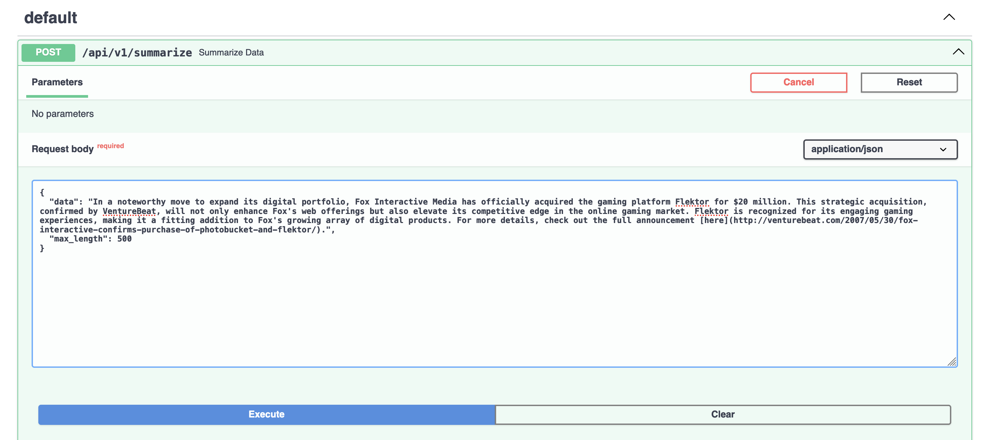
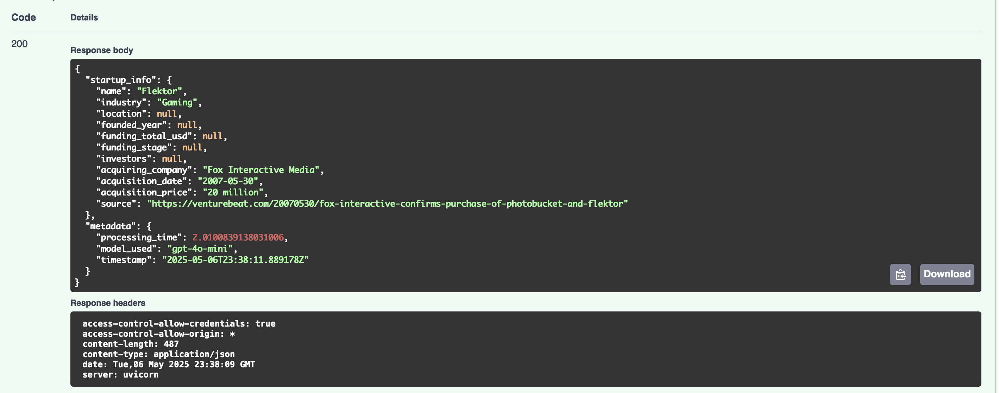
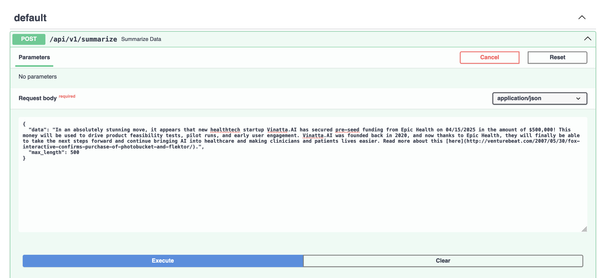
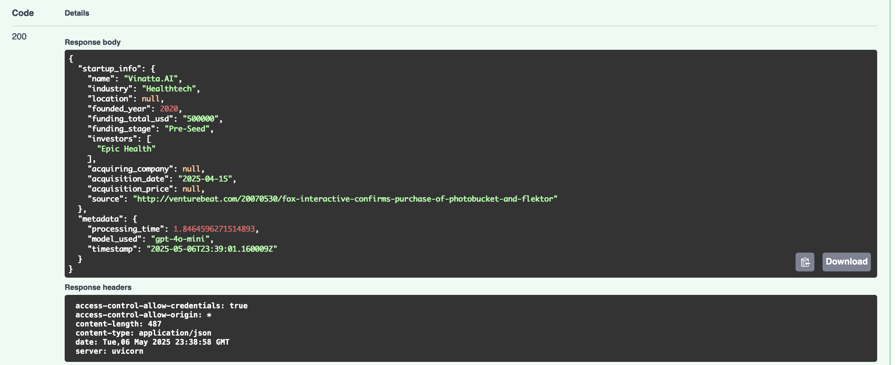

# LLM Startup Data Summarization Microservice

This microservice processes raw startup data and generates structured summaries using LLM technology. It can handle both funding and acquisition data, providing natural language summaries with proper citations.

## Features

- Data ingestion and cleaning
- LLM-powered summarization with funding/acquisition focus
- Structured JSON output with citations
- RESTful API interface
- Docker support

## Project Structure

```
.
├── app/
│   ├── api/
│   │   └── routes.py          # FastAPI routes and endpoints
│   ├── core/
│   │   └── config.py         # Application settings and configuration
│   ├── services/
│   │   ├── data_processor.py # Text processing and cleaning
│   │   └── llm_service.py    # LLM integration and prompt management
│   └── models/
│       └── schemas.py        # Pydantic models for request/response
├── data/
│   ├── raw/                  # Raw data files
|   |   |--...
│   └── processed/            # Processed data output
|   |   |--...
├── notebooks/                # Jupyter notebooks for analysis
|   |   |--- messy_data_gen.ipynb
├── Dockerfile
├── requirements.txt          # All python library dependencies
└── main.py                   # Application entry point
└── README.md                   # Project overview
```

## Setup Instructions
### I created this project on an M1 Macbook Pro, so adjust any of these commands as necessary.
### Also go further below in the Docker Support Section for instructions with that

1. Create a virtual environment:
```bash
python -m venv env
source env/bin/activate
```

2. Install dependencies:
```bash
pip3 install -r requirements.txt
```

3. Set up environment variables:
Create a `.env` file in the root directory with:
```
OPENAI_API_KEY=your_api_key_here
```

4. Run the application:
```bash
uvicorn main:app --reload
```

## API Usage

### Summarizing Startup Data

If you haven't already, run the Docker application or the commands above. Then open up the URL on localhost and add /docs to the end of it to see the summarize endpoint

**Endpoint:** `POST /api/v1/summarize`

### Example 1 (Synthetically created for acquisition)
**Request Body Example:**
```json
{
    "data": "In a noteworthy move to expand its digital portfolio, Fox Interactive Media has officially acquired the gaming platform Flektor for $20 million. This strategic acquisition, confirmed by VentureBeat, will not only enhance Fox's web offerings but also elevate its competitive edge in the online gaming market. Flektor is recognized for its engaging gaming experiences, making it a fitting addition to Fox's growing array of digital products. For more details, check out the full announcement [here](http://venturebeat.com/2007/05/30/fox-interactive-confirms-purchase-of-photobucket-and-flektor/).",
    "max_length": 500
}
```




**Response Example:**
```json
{
  "startup_info": {
    "name": "Flektor",
    "industry": "Gaming",
    "location": null,
    "founded_year": null,
    "funding_total_usd": null,
    "funding_stage": null,
    "investors": null,
    "acquiring_company": "Fox Interactive Media",
    "acquisition_date": "2007-05-30",
    "acquisition_price": "20 million",
    "source": "http://venturebeat.com/20070530/fox-interactive-confirms-purchase-of-photobucket-and-flektor"
  },
  "metadata": {
    "processing_time": 1.7973570823669434,
    "model_used": "gpt-4o-mini",
    "timestamp": "2025-05-06T23:17:42.217803Z"
  }
}
```



### Example 2 (Manually created user input for funding)
**Request Body Example:**
```json
{
    "data": "In an absolutely stunning move, it appears that new healthtech startup Vinatta.AI has secured pre-seed funding from Epic Health on 04/15/2025 in the amount of $500,000! This money will be used to drive product feasibility tests, pilot runs, and early user engagement. Vinatta.AI was founded back in 2020, and now thanks to Epic Health, they will finally be able to take the next steps forward and continue bringing AI into healthcare and making clinicians and patients lives easier. Read more about this [here](http://venturebeat.com/2007/05/30/fox-interactive-confirms-purchase-of-photobucket-and-flektor/).",
    "max_length": 500
}
```



**Response Example:**
```json
{
  "startup_info": {
    "name": "Vinatta.AI",
    "industry": "Healthtech",
    "location": null,
    "founded_year": 2020,
    "funding_total_usd": "500000",
    "funding_stage": "Pre-Seed",
    "investors": [
      "Epic Health"
    ],
    "acquiring_company": null,
    "acquisition_date": "2025-04-15",
    "acquisition_price": null,
    "source": "http://venturebeat.com"
  },
  "metadata": {
    "processing_time": 1.782545804977417,
    "model_used": "gpt-4o-mini",
    "timestamp": "2025-05-06T23:33:46.276991Z"
  }
}
```



## Features in Detail

### Data Processing
- Text cleaning and normalization
- Support for both funding and acquisition data
- Automatic detection of inputted summary type needed (funding vs acquisition)

### LLM Integration
- Structured prompt engineering
- Temperature for varied outputs

### API Features
- Async request handling
- Input validation
- Structured error responses
- CORS support

## Docker Support

Build and run with Docker:
```bash
docker build -t startup-summarizer .
docker run -p 8000:8000 startup-summarizer
```

## License

MIT 